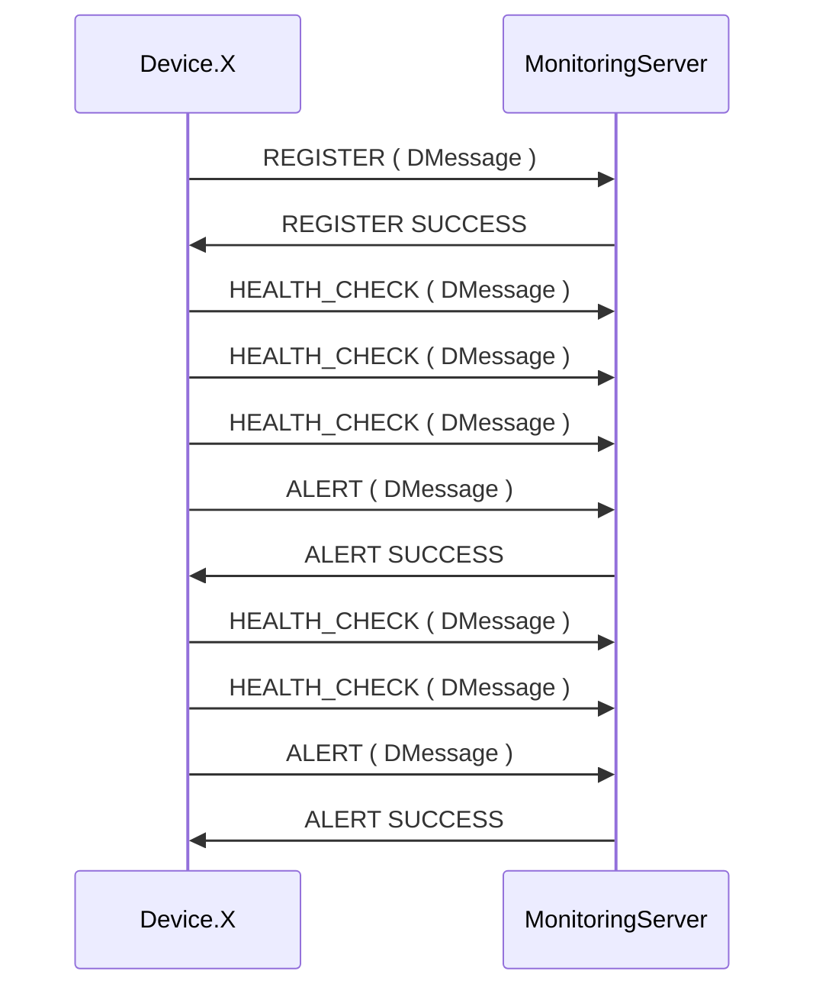

# Device Monitoring

Device Monitoring is consists of two modules.

- First module is device-pool that is generated virtual devices.
- Second module is monitoring server. It consumes messages that are coming from devices. 

## Initialize

Device-pool is based on spring-boot project and runs `localhost:8080`.

Monitoring-Server is based on spring-boot project and `localhost:7070`.  

## Messaging Flow

